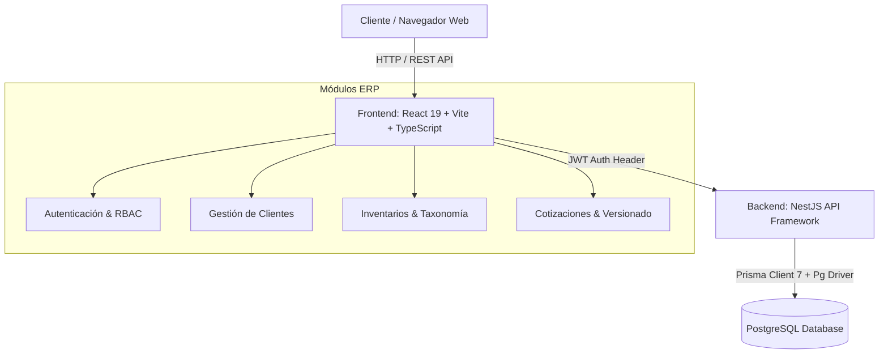
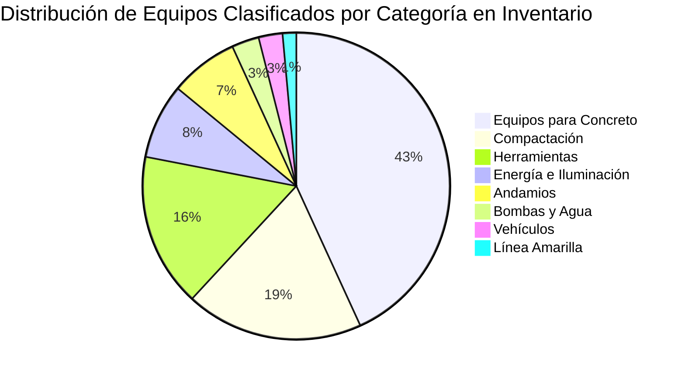

# Informe de Auditoría y Estado del Sistema ERP de Alquileres

**Proyecto**: Sistema ERP Comercial y Operativo de Alquiler de Maquinaria y Equipos  
**Fecha de Auditoría**: 15 de Agosto, 2026  
**Sistema de Diseño**: Precision Enterprise (`#1A73E8` Azul Corporativo, `#37474F` Pizarra, `#C55500` Naranja Industrial)  
**Arquitectura**: Next-Gen Monorepo Full-Stack (NestJS + Prisma 7 + PostgreSQL / React 19 + TypeScript + Vite)

---

## 🛠️ 1. Arquitectura Técnica y Stack de Tecnologías

### Stack Técnico
* **Frontend**: React 19, TypeScript, Vite, Tailwind CSS, Lucide React Icons, React Hook Form, Zod Validators, Axios.
* **Backend**: NestJS, TypeScript, Prisma ORM 7.9, Driver Adapter `@prisma/adapter-pg` con Pool de PostgreSQL (`pg`), Passport JWT, Bcrypt.
* **Base de Datos**: PostgreSQL (`erp_dev`), Modelo multitenant con aislamiento por empresa (`empresaId`) y sucursal (`sucursalId`).
* **Layout**: Diseño fluido de pantalla completa (100% pantalla completa, sin límites fijos estrechos).

---

## 📦 2. Módulos Desarrollados y Funcionalidades Live

### Módulo 1: Autenticación, Seguridad y Sesiones (Auth Module)
- **Sesión Única Activa**: Enforzamiento de token de sesión (`sessionToken` en `JwtStrategy`). Si el usuario inicia sesión en otro navegador, la sesión previa invalida las llamadas.
- **Expiración de Token**: JWT configurado a 8 horas con renovación segura.
- **Control de Acceso por Roles (RBAC)**:
  - `ADMIN`: Control total del sistema y empresas.
  - `GERENTE`: Aprobaciones comerciales, devoluciones con observaciones, altas y bajas.
  - `COMERCIAL`: Creación de cotizaciones, clientes y re-envío de presupuestos.
  - `OPERACIONES` / `MANTENIMIENTO`: Control de estados de maquinaria y horómetros.

---

### Módulo 2: Directorio de Clientes (Clients Module)
- **Fichas de Contacto Comercial**: Captura de Cédula/RUC, Razón Social, Teléfono, Correo de Facturación y Dirección.
- **Máscara Automática de Cédula**: Formato nicaragüense automático `001-XXXXXX-XXXXXL`.
- **Consolidación de Teléfonos**: Unificación de líneas Movistar, Claro y Convencional en el teléfono principal.
- **Tabla Ampliada No Recortada**: Visualización completa sin truncamiento de datos y filas expandibles.

---

### Módulo 3: Inventario y Taxonomía Estructurada (Inventory Module)
#### A. Taxonomía Jerárquica Oficial de 12 Categorías
Estructura profesional de inventarios ERP:

$$\text{Categoría} \longrightarrow \text{Subcategoría} \longrightarrow \text{Producto / Modelo} \longrightarrow \{\text{Marca, Serie, Atributos}\}$$

| # | Categoría Principal | Subcategorías Incluidas |
|---|--------------------|-------------------------|
| 1 | **Línea Amarilla** | Minicargadores, Retroexcavadoras, Excavadoras, Bulldozers, Motoniveladoras, Cargadores Frontales, Rodillos Grandes |
| 2 | **Compactación** | Compactadora Canguro, Vibroplanchas, Rodillos de Empuje, Rodillos Hombre a Bordo |
| 3 | **Equipos para Concreto** | Allanadoras, Mezcladoras (1 y 2 sacos), Vibradores, Regletas, Revocadoras, Bateas |
| 4 | **Encofrado** | Placas de Encofrado (4x4, 4x8, 24x8), Esquineros, Alineadores, Cuñas, Barules, Flotas, Fillers |
| 5 | **Energía e Iluminación** | Generadores, Generadores Soldadores, Torres de Iluminación, Extensiones Eléctricas |
| 6 | **Bombas y Agua** | Bombas de Agua, Bombas Traga Sólidos, Hidrolavadoras, Hidroestáticas |
| 7 | **Herramientas** | Martillos Demoledores, Rotomartillos, Pulidoras, Chicharras, Brocas, Compresores |
| 8 | **Andamios** | Andamio Estándar, Industrial, Carga, Plataformas, Rodos, Escaleras, Niveladores, Platos Base |
| 9 | **Seguridad Industrial** | Arneses, Líneas de Vida |
| 10 | **Vehículos** | Camiones, Camionetas, Vehículos de Carga |
| 11 | **Infraestructura** | Contenedores Oficina, Contenedores Climatizados |
| 12 | **Accesorios y Repuestos** | Filtros, Repuestos, Piezas y Consumibles |

#### B. Métodos de Visualización Intercambiables
* 📋 **Modo Lista (Tabla Ordenable)**:
  * Filas y columnas completas.
  * **Ordenamiento interactivo** al hacer clic en cualquier encabezado (Producto, Categoría, Subcategoría, Marca, Stock, Precio Día, Estado).
* 🔲 **Modo Casilla (Cuadrícula / Tarjetas Grid)**:
  * Tarjetas individuales con insignias de categoría/subcategoría, medidor de stock disponible/total, horómetro, número de serie y tarifa diaria destacada.
* 🎛️ **Filtros Combinados**: Filtro por texto libre, filtro por Categoría y filtro dependiente por Subcategoría.

---

### Módulo 4: Cotizaciones, Presupuestos y Versionado Automático (Quotations Module)
- **Cálculo Financiero Dinámico**:
  $$\text{Subtotal Ítem} = (\text{Precio Unitario} \times \text{Días} \times \text{Cantidad}) - \text{Descuento Ítem}$$
  $$\text{Total Cotización} = (\text{Subtotal Bruto} - \text{Descuento Global}) + \text{IVA (15\%)}$$
- **Limpieza de Ceros Innecesarios**: Entradas de precio unitario y descuentos configuradas sin ceros por defecto (`0.00` en placeholder), permitiendo escribir dígitos directamente.
- **Protección de Datos de Cliente**: Los campos de teléfono y email se completan automáticamente al elegir cliente y quedan protegidos contra escritura.
- **Versionado Automático (`v1`, `v2`, `v3...`)**:
  * Eliminado el botón manual innecesario.
  * Al hacer clic en **"Enviar a Revisión"**, el sistema auto-guarda las modificaciones del formulario y genera automáticamente la versión consecutiva (`v2`), pasándola a `EN_REVISION`.
- **Flujo de Devolución con Observaciones ([`RevisionNoteModal.tsx`](file:///C:/Users/abdia/erp-rental-system/frontend/src/modules/quotations/components/RevisionNoteModal.tsx))**:
  * Un supervisor/gerente puede hacer clic en **"Devolver con Observaciones"** e ingresar la nota de corrección.
  * La propuesta muestra una alerta destacada en naranja con la observación al vendedor.
- **Modo Lectura Histórico Protegido ([`VersionHistoryModal.tsx`](file:///C:/Users/abdia/erp-rental-system/frontend/src/modules/quotations/components/VersionHistoryModal.tsx))**:
  * Consultar versiones anteriores (`v1` cuando existe `v2`) entra en **Modo Lectura Protegido**: bloquea todos los campos, oculta los botones de envío y muestra un aviso con candado 🔒.
- **Panel de Cotizaciones con Pestañas e Insignias Dinámicas**:
  * **Todas (`N`)**
  * **Pendientes (`N`)**
  * **En Revisión (`N`)** (Protegida: mientras está en revisión solo permite *Devolver* o *Aprobar*)
  * **Devueltas (`N`)** (Sale automáticamente de esta pestaña cuando el vendedor corrige y re-envía)
  * **Aprobadas (`N`)**

---

## 📊 3. Resumen Cuantitativo del Estado Actual

| Indicador del Sistema | Valor Actual | Estado |
|-----------------------|--------------|--------|
| **Total Equipos en Inventario** | 278 activos | 100% Clasificados en Subcategorías |
| **Categorías Oficiales** | 12 categorías | Limpias sin duplicados |
| **Pestañas de Estado de Cotizaciones** | 5 pestañas | Contadores en tiempo real live |
| **Errores de Compilación (TypeScript / Vite)** | 0 errores | Frontend y Backend compilan limpio |
| **Integridad de Base de Datos** | PostgreSQL OK | Estructura multitenant |

---

## 🎯 4. Próximos Pasos Sugeridos para la Siguiente Fase

1. **Módulo de Contratos y Despachos de Renta**: Transformación directa de cotización aprobada (`ACEPTADA`) a Contrato de Arrendamiento con asignación de número de serie físico.
2. **Módulo de Mantenimiento y Horómetros**: Control de mantenimientos preventivos/correctivos basados en la acumulación de horómetros de la maquinaria.
3. **Módulo de Facturación y Cobros**: Generación de facturas comerciales e integración con pagos parciales/depósitos de garantía.
