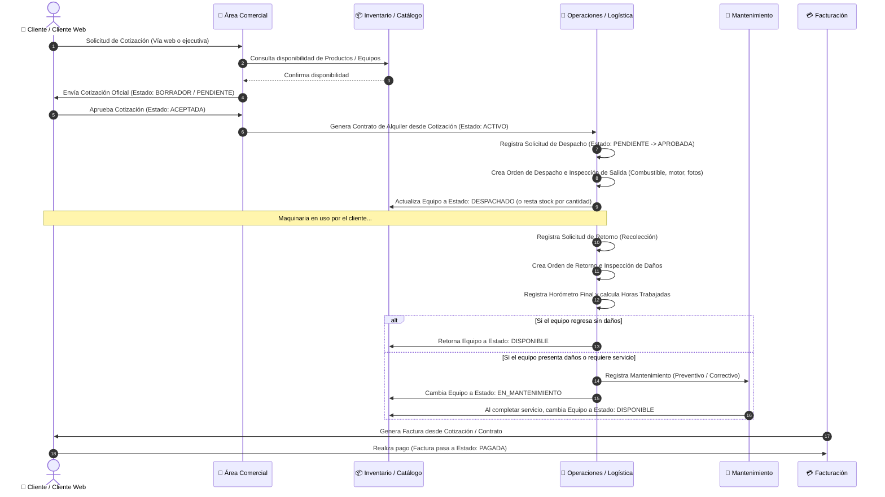
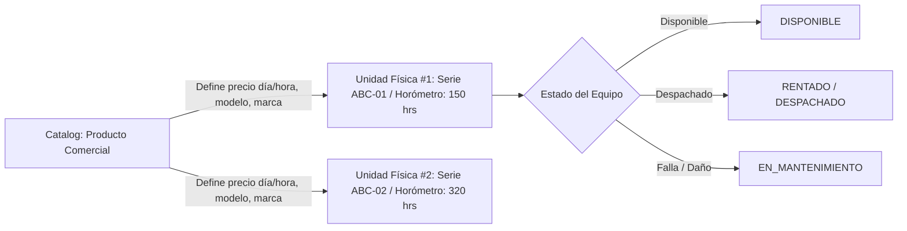
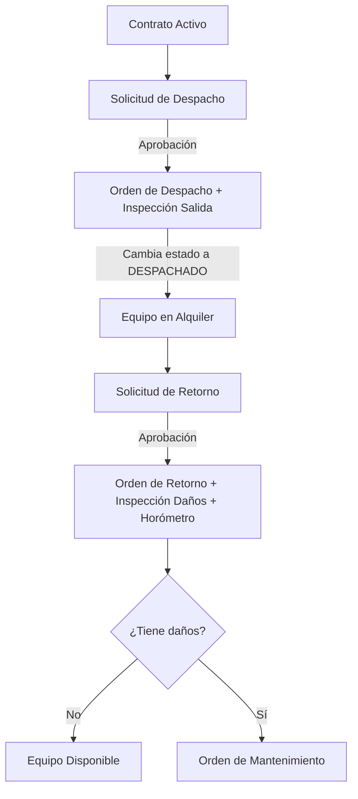
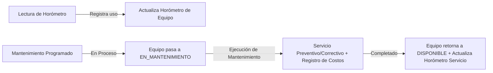

# 📐 Diagramas de Arquitectura y Flujos de Trabajo ERP (Compatibles con Draw.io)

> **Instrucciones para importar en Draw.io:**
> 1. Abre [Draw.io](https://app.diagrams.net/).
> 2. En el menú superior, ve a **Arrange (Organizar) > Insert (Insertar) > Advanced (Avanzado) > Mermaid**.
> 3. Copia y pega cualquiera de los bloques de código `mermaid` que se muestran a continuación y haz clic en **Insert**.

---

## 1. 📊 Mapa General de Módulos (Activos vs. Inactivos)

```mermaid
graph TD
    classDef activo fill:#2e7d32,stroke:#1b5e20,color:#ffffff,stroke-width:2px;
    classDef inactivo fill:#c62828,stroke:#b71c1c,color:#ffffff,stroke-width:2px,stroke-dasharray: 5 5;
    classDef core fill:#1565c0,stroke:#0d47a1,color:#ffffff,stroke-width:2px;

    subgraph ERP_SYSTEM["🏗️ SISTEMA ERP DE ALQUILER DE MAQUINARIA"]
        subgraph MODULOS_ACTIVOS["✅ Módulos Activos (En Producción)"]
            A1["🔑 Autenticación & Seguridad<br/>(JWT, Sesión Única, RBAC)"]:::activo
            A2["👥 Gestión de Clientes<br/>(Directorio RFC/Empresas)"]:::activo
            A3["📦 Inventario & Catálogo<br/>(Producto Comercial vs Unidad Física)"]:::activo
            A4["📄 Cotizaciones Comerciales<br/>(Internas y Solicitud Pública)"]:::activo
            A5["📜 Gestión de Contratos<br/>(Generación desde Cotización)"]:::activo
            A6["🚚 Operaciones & Logística<br/>(Solicitudes Despacho/Retorno e Inspecciones)"]:::activo
            A7["💳 Facturación & Cobros<br/>(Facturas y Control de Pago)"]:::activo
            A8["🔧 Mantenimiento de Maquinaria<br/>(Preventivo / Correctivo)"]:::activo
            A9["⏱️ Lectura de Horómetros<br/>(Seguimiento de Horas de Uso)"]:::activo
            A10["📅 Disponibilidad & Reservas<br/>(Calendario de Maquinaria)"]:::activo
        end

        subgraph MODULOS_INACTIVOS["❌ Módulos Inactivos / Futuras Fases"]
            I1["🛒 Compras & Proveedores<br/>(Órdenes de Compra y Repuestos)"]:::inactivo
            I2["👷 Recursos Humanos & Operadores<br/>(Asignación de choferes y nómina)"]:::inactivo
            I3["📊 Contabilidad General & Libro Mayor<br/>(Asientos contables e impuestos)"]:::inactivo
            I4["📈 Reportes BI & Analytics<br/>(Dashboards ejecutivos avanzados)"]:::inactivo
            I5["📡 Telemetría GPS / IoT<br/>(Captura automática de horómetros por sensores)"]:::inactivo
        end
    end
```

---

## 2. 🔄 Flujo de Trabajo Operativo Principal (End-to-End)

Este diagrama representa el ciclo de vida completo de un equipo desde la cotización hasta el retorno y mantenimiento.

---

## 3. 🧩 Flujos Específicos por Módulo Activo

### A. Módulo de Inventario (Separación Producto vs. Equipo)

### B. Módulo de Operaciones (Solicitudes -> Despachos -> Retornos)

### C. Módulo de Mantenimiento y Horómetros

---

## 📌 Módulos y su Estado de Implementación

| Módulo | Tipo | Estado Actual | Descripción |
| :--- | :--- | :--- | :--- |
| **Autenticación & Seguridad** | Backend / Frontend | 🟢 **ACTIVO** | Login, tokens JWT, verificación de sesión única por dispositivo, RBAC. |
| **Clientes** | Backend / Frontend | 🟢 **ACTIVO** | CRUD completo de clientes, datos de facturación (RFC/RUC), direcciones. |
| **Inventario** | Backend / Frontend | 🟢 **ACTIVO** | Separación entre Producto Comercial (Precios) and Equipos Físicos (Series/Horómetros). |
| **Cotizaciones** | Backend / Frontend | 🟢 **ACTIVO** | Cotizaciones internas, solicitudes públicas `/public-request`, control de versiones. |
| **Contratos** | Backend / Frontend | 🟢 **ACTIVO** | Creación de Contratos automáticos desde cotizaciones aceptadas. |
| **Operaciones** | Backend / Frontend | 🟢 **ACTIVO** | Solicitudes de Despacho/Retorno, Órdenes de Despacho e Inspecciones de Daños. |
| **Facturación** | Backend / Frontend | 🟢 **ACTIVO** | Facturación desde cotización y control de estado de pago (Pendiente / Pagada). |
| **Mantenimiento** | Backend / Frontend | 🟢 **ACTIVO** | Registro de mantenimientos preventivos y correctivos, afectación de disponibilidad. |
| **Horometros** | Backend / Frontend | 🟢 **ACTIVO** | Registro de lectura de horómetros por inspección o campo y horas trabajadas. |
| **Disponibilidad** | Backend / Frontend | 🟢 **ACTIVO** | Consulta de reservas por rango de fechas para maquinaria. |
| **Compras / Repuestos** | N/A | 🔴 **INACTIVO** | Planeado para fase futura (Gestión de proveedores y repuestos de mantenimiento). |
| **Recursos Humanos** | N/A | 🔴 **INACTIVO** | Planeado para fase futura (Asignación de operadores y choferes de transporte). |
| **Contabilidad General** | N/A | 🔴 **INACTIVO** | Planeado para fase futura (Libro mayor, balances contables e impuestos integrados). |
| **Telemetría GPS / IoT** | N/A | 🔴 **INACTIVO** | Planeado para fase futura (Captura automática de horómetros vía GPS/IoT). |
