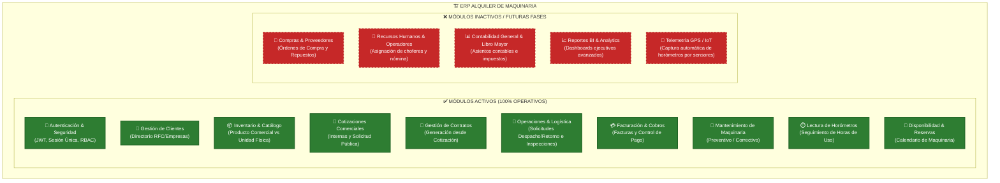
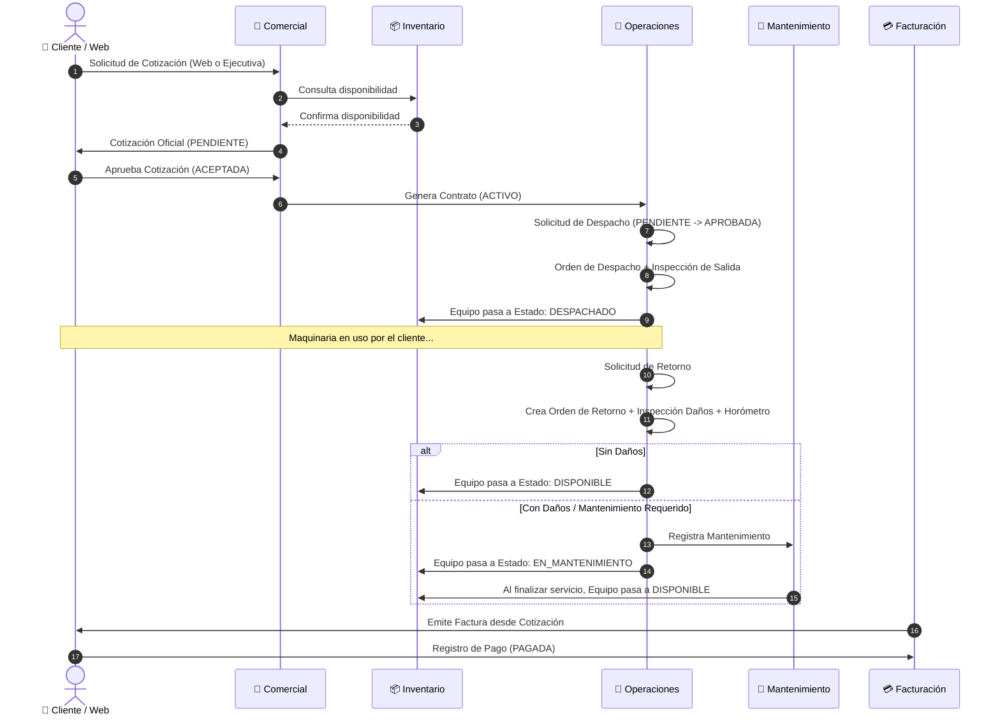
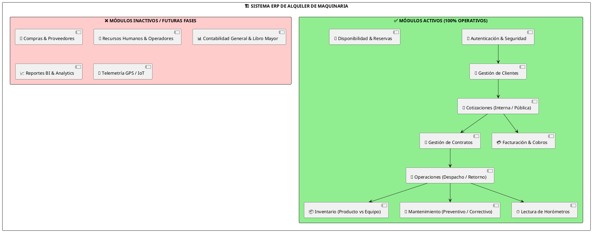

# 🌐 Código Completo para Visualizadores Web (Mermaid Live & PlantText)

---

## 🎨 OPCIÓN 1: Visualizador Mermaid Live Editor
👉 **Sitio Web:** [https://mermaid.live](https://mermaid.live)  
*Simplemente abre el enlace, borra el texto de la izquierda y pega el siguiente código completo.*

### 1. Mapa Completo de Módulos (Activos vs Inactivos)

### 2. Flujo Operativo End-to-End (Ciclo de Alquiler)

---

## 🎨 OPCIÓN 2: Visualizador PlantText (PlantUML)
👉 **Sitio Web:** [https://www.planttext.com](https://www.planttext.com)  
*Abre PlantText y pega el siguiente código PlantUML completo.*

