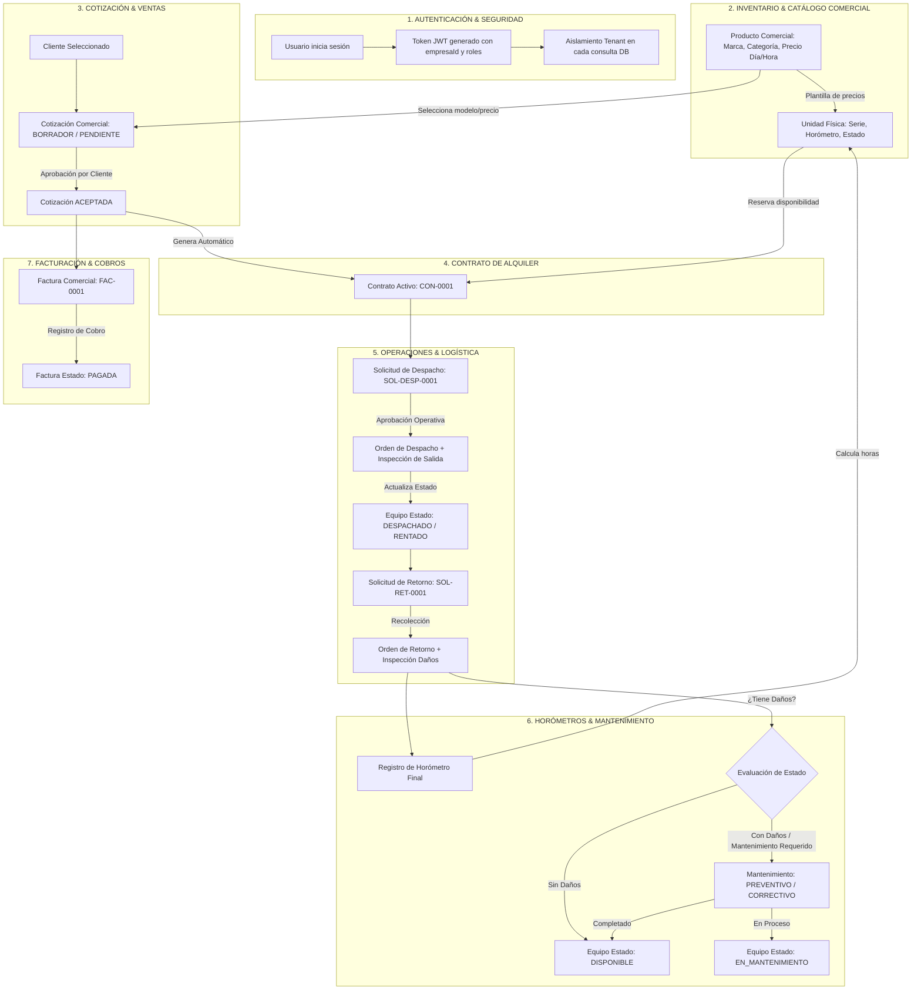
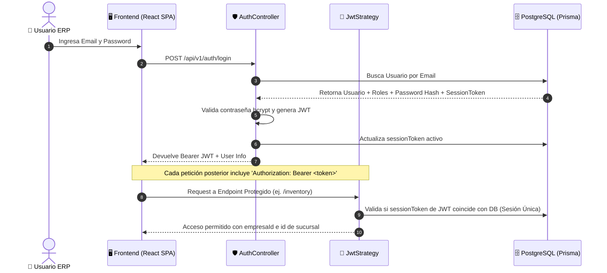
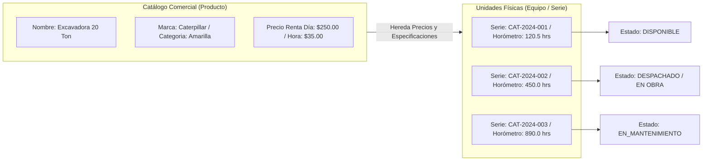
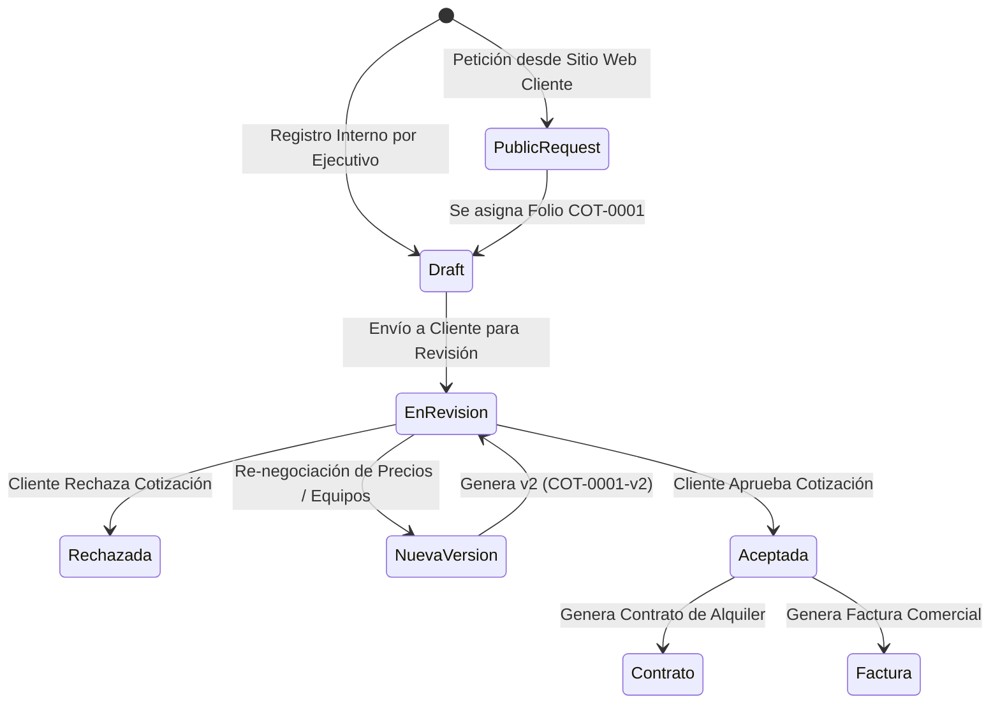
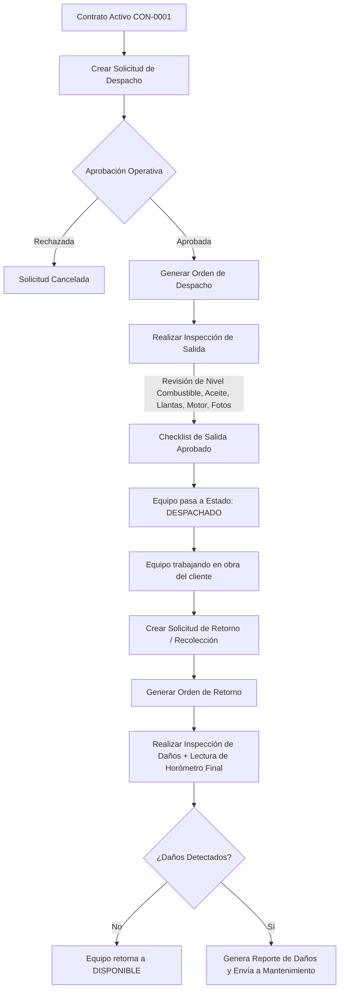
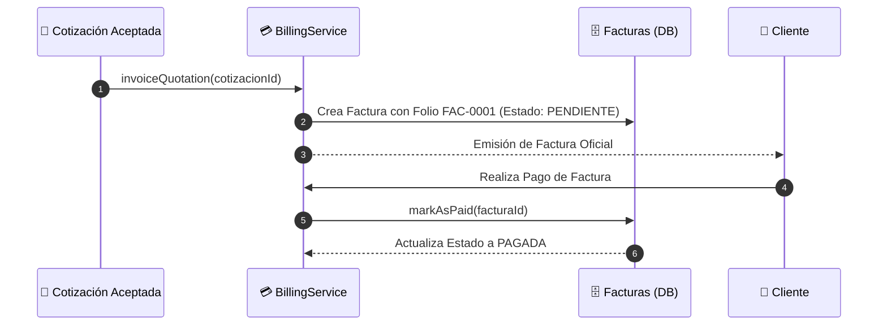

# 🔄 Flujos de Trabajo Detallados por Módulo (Viaje de Datos Paso a Paso)

> **Instrucciones para visualizar:**
> Copia cualquier bloque `mermaid` a continuación y pégalo en [https://mermaid.live](https://mermaid.live) o en Draw.io (**Arrange > Insert > Advanced > Mermaid**).

---

## 1. 🌐 Diagrama Global de Datos Integrado (Viaje Completo del Dato)

Este diagrama muestra cómo viaja la información entre **todos** los módulos del ERP en una transacción real de alquiler de maquinaria:

---

## 2. 🔍 Flujo Detallado Módulo por Módulo

### 🔑 Módulo 1: Autenticación, Usuarios y Multitenancy

---

### 📦 Módulo 2: Inventario (Catálogo Comercial vs. Unidades Físicas)

---

### 📄 Módulo 3: Cotizaciones & Clientes

---

### 🚚 Módulo 4: Operaciones, Logística e Inspecciones

---

### 🔧 Módulo 5: Mantenimiento y Control de Horómetros

```mermaid
flowchart LR
    subgraph HOROMETRO["Módulo de Horómetros"]
        H1[Lectura Inspección Campo / Retorno] --> H2[Calcula Horas Trabajadas = Horómetro Nuevo - Anterior]
        H2 --> H3[Actualiza Horómetro Acumulado del Equipo]
    end

    subgraph MANTENIMIENTO["Módulo de Mantenimiento"]
        M1[Reporte de Daño u Horómetro de Servicio Alcanzado] --> M2[Crea Registro Mantenimiento PREVENTIVO/CORRECTIVO]
        M2 --> M3[Cambia Estado de Equipo a: EN_MANTENIMIENTO]
        M3 --> M4[Registro de Mano de Obra, Repuestos y Costos]
        M4 --> M5[Marca Mantenimiento como COMPLETADO]
        M5 --> M6[Cambia Estado de Equipo a: DISPONIBLE + Actualiza Horómetro Ultimo Servicio]
    end

    H3 -->|Dispara alerta preventivo| M1
```

---

### 💳 Módulo 6: Facturación & Cobros

---

## 📌 Resumen de Flujo de Datos por Módulo

| Módulo | Entrada (Input) | Proceso Principal | Salida (Output) |
| :--- | :--- | :--- | :--- |
| **Autenticación** | Email + Password | Validación bcrypt + token JWT + sesión única por dispositivo | Token JWT + Menú de Roles |
| **Clientes** | Razón Social, RFC, Contacto | Registro multitenant por `empresaId` | Cliente habilitado para Cotizar |
| **Inventario** | Producto Comercial + Datos de Equipo | Separación de Precios/Catálogo vs Series/Horómetros físicos | Equipos listos para Cotizar/Despachar |
| **Cotizaciones** | Solicitud Cliente / Precios | Cálculo de subtotales, impuestos y versiones | Cotización `ACEPTADA` o `RECHAZADA` |
| **Contratos** | Cotización `ACEPTADA` | Bloqueo de equipos y emisión de contrato `ACTIVO` | Contrato `CON-XXXX` |
| **Operaciones** | Contrato `ACTIVO` | Solicitud Despacho/Retorno + Inspección Salida/Daños | Equipos en Estado `DESPACHADO` o `RETORNO` |
| **Mantenimiento** | Inspección con Daños u Horómetro | Servicio Preventivo/Correctivo + Control de Costos | Equipo Reparado en Estado `DISPONIBLE` |
| **Horómetros** | Lectura física o en campo | Cálculo de `horasTrabajadas = horometroNuevo - anterior` | Horómetro actualizado en Equipo |
| **Facturación** | Cotización / Contrato | Generación de comprobante fiscal y gestión de cobros | Factura `PAGADA` |
