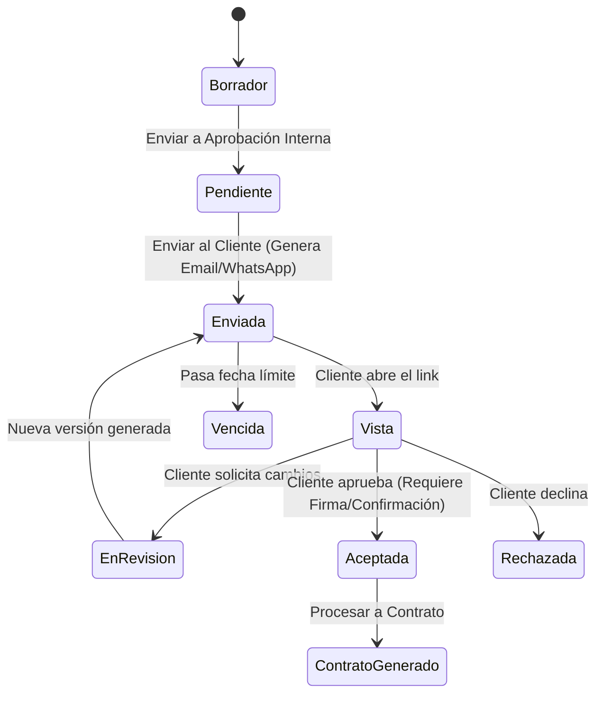
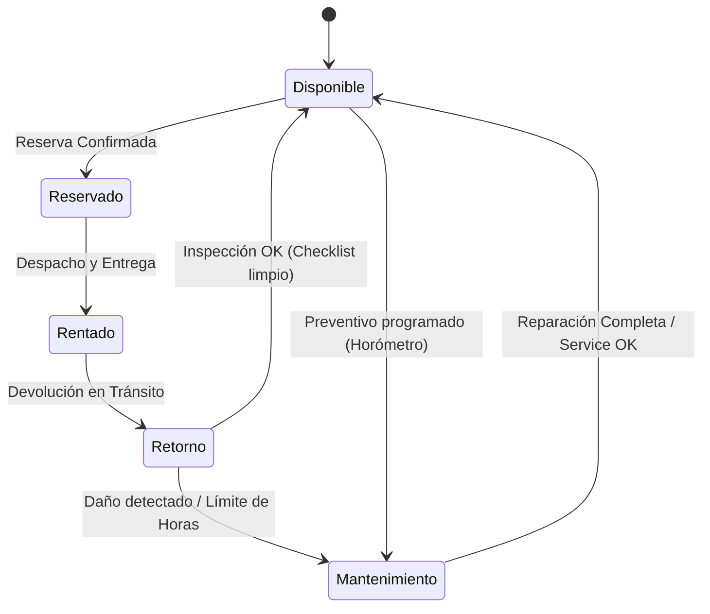

# Análisis y Optimización de la Arquitectura del ERP

Este documento contiene el análisis estructural y las recomendaciones para la construcción del **ERP Rental Management System**, un sistema profesional de gestión de renta de maquinaria y equipos de construcción.

---

## 1. Validación de la Estructura y Pila Tecnológica

La combinación de **React 19 (Vite) + NestJS + Prisma ORM + PostgreSQL 17 + Redis** es altamente recomendada para un ERP moderno y robusto. A continuación, se detallan las ventajas y las recomendaciones específicas de diseño sobre tu propuesta.

### Frontend (React 19 + TypeScript)
- **Estructura Modular por Dominios (`modules/`)**: Es la mejor aproximación para aplicaciones empresariales de gran tamaño. Permite que equipos de desarrollo trabajen en paralelo sobre diferentes módulos (ej. `inventory` vs `invoices`) sin interferir entre sí.
- **Shared vs Modules**: Mantener componentes globales (inputs reutilizables, modales genéricos) en `shared/components/` y la lógica específica del negocio dentro de cada módulo garantiza un acoplamiento mínimo.
- **TanStack Query (React Query)**: Clave para el manejo del estado del servidor. Facilitará la invalidación de caché de inventario en tiempo real cuando se realice un despacho o devolución.

### Backend (NestJS + Prisma + Postgres)
- **Desacoplamiento con Repositorios**: Aunque Prisma provee una API directa para consultas, implementar la capa de `repositories/` en cada módulo es una excelente decisión arquitectónica. Permite:
  1. Abstraer consultas complejas y mantener los `services` limpios.
  2. Implementar Row Level Security (RLS) o filtros de multiempresa de manera centralizada.
  3. Facilitar la realización de pruebas unitarias mediante mocks del repositorio en lugar de mockear todo Prisma.
- **Redis**: Actuará como almacenamiento de sesiones rápidas, almacenamiento temporal de rate limiting por IP, y caché de disponibilidad rápida (por ejemplo, para el mapa de calor de equipos libres).

---

## 2. Recomendación Crítica: Estrategia de Multiempresa (Multi-tenancy)

Dado el requerimiento de que el sistema sea **escalable para múltiples sucursales y empresas**, es crucial definir el modelo de base de datos en esta fase inicial.

### Modelos de Multi-tenancy
1. **Base de Datos Única con Esquemas Separados (Schema-based)**:
   - *Pros*: Mayor aislamiento de datos por empresa.
   - *Contras*: Dificulta las migraciones con Prisma (ya que Prisma no soporta múltiples esquemas dinámicos de forma nativa sin configuraciones complejas/workarounds de conexión).
2. **Base de Datos Única con Discriminador Compartido (Row-level Isolation)** (Recomendado):
   - *Cómo funciona*: Todas las tablas críticas tienen las columnas `tenant_id` (empresa) y `sucursal_id` (sucursal).
   - *Pros*: Muy sencillo de implementar con Prisma. Las migraciones se aplican de forma global una sola vez.
   - *Aseguramiento*: Implementamos un middleware/interceptor en NestJS que inyecta automáticamente el `tenant_id` y `sucursal_id` extraídos del JWT del usuario en todas las consultas al repositorio.

```prisma
// Ejemplo de relaciones iniciales en Prisma
model Empresa {
  id         String     @id @default(uuid())
  nombre     String
  sucursales Sucursal[]
  usuarios   Usuario[]
  equipos    Equipo[]
  // ... resto de entidades globales
}

model Sucursal {
  id         String   @id @default(uuid())
  empresaId  String
  empresa    Empresa  @relation(fields: [empresaId], references: [id])
  nombre     String
  ciudad     String
  equipos    Equipo[]
  usuarios   Usuario[]
}
```

---

## 3. Lógica de Disponibilidad e Inventario (El Corazón del Negocio)

El inventario de maquinaria requiere dos tipos de tratamiento de datos:
1. **Equipos Serializados**: Unidades únicas (ej. Excavadora Caterpillar 320, N/S: CAT001) con horómetro propio y programa de mantenimiento individual.
2. **Equipos por Volumen / Lotes**: Elementos intercambiables que se rentan por cantidad (ej. 150 marcos de andamio, 80 puntales metálicos).

### Control de Reservas y Traslapes (Overlapping)
Para evitar la sobre-reserva en tiempo real, las solicitudes y cotizaciones aprobadas deben crear registros en una tabla de `Reserva` con rangos de tiempo. 
En PostgreSQL, utilizaremos una consulta de validación de traslape antes de confirmar una reserva:

$$\text{Traslape} = (\text{FechaInicioRenta} \le \text{FechaFinReserva}) \land (\text{FechaFinRenta} \ge \text{FechaInicioReserva})$$

En Prisma, esta validación se traduce a:
```typescript
const traslapes = await prisma.reserva.findMany({
  where: {
    equipoId: targetEquipoId,
    estado: 'CONFIRMADA',
    OR: [
      {
        fechaInicio: { lte: fechaFinRequerida },
        fechaFin: { gte: fechaInicioRequerida },
      },
    ],
  },
});
if (traslapes.length > 0) {
  throw new BadRequestException('El equipo no está disponible en las fechas solicitadas');
}
```

---

## 4. Máquina de Estados para Flujo Comercial y Operativo

Para evitar inconsistencias en la base de datos, cada entidad clave del ERP se comportará como una **Máquina de Estados Finita (FSM)**.

### A. Flujo de Estados de una Cotización


### B. Flujo de Estados de un Equipo (Inventario)


---

## 5. Diseño del Flujo de Notificaciones

Proponemos la siguiente arquitectura para la tabla de **Notificaciones** para asegurar que el sistema envíe los correos y mensajes de WhatsApp de manera asíncrona mediante colas de trabajo (ej. NestJS BullMQ + Redis) para evitar bloquear el hilo principal de la API.

### Campos Recomendados para la Tabla `Notificacion`:
- **`id`**: UUID.
- **`tenantId`**: Para multiempresa.
- **`evento`**: Identificador único (ej. `COTIZACION.ENVIADA`, `CONTRATO.VENCIDO`, `MANTENIMIENTO.ALERTA`).
- **`tokenPublico`**: UUID aleatorio que permite al cliente ver la cotización/solicitud en el portal sin necesidad de iniciar sesión si se envía un enlace directo (Token de Acceso Rápido Temporal).
- **`reintentos`**: Entero para llevar el control en caso de fallos con el proveedor de correo o WhatsApp.
- **`estado`**: `PENDIENTE`, `ENVIADO`, `ENTREGADO`, `FALLIDO`.

---

## 6. Siguientes Pasos del Desarrollo

Para estructurar el proyecto tal como los equipos profesionales, iniciaremos construyendo los **4 Documentos Base** en el subdirectorio `docs/` de la raíz del proyecto.

1. **`docs/1-db-model-erd.md`**: Modelo entidad-relación detallado (Prisma Schema definitivo).
2. **`docs/2-business-rules.md`**: Reglas detalladas para el cálculo de tarifas (diaria, semanal, mensual), días festivos, cobro de horómetros extra, y penalizaciones por daños.
3. **`docs/3-api-endpoints.md`**: Definición de endpoints de API REST, parámetros esperados, validaciones de DTOs y mapeo de permisos (RBAC).
4. **`docs/4-deployment-docker.md`**: Arquitectura de red interna de Docker Compose, SSL dinámico con Let's Encrypt (Nginx) y scripts de copias de seguridad.

Una vez validados, generaremos los directorios del proyecto y configuraremos el esqueleto base del Backend en NestJS y el Frontend en React.
